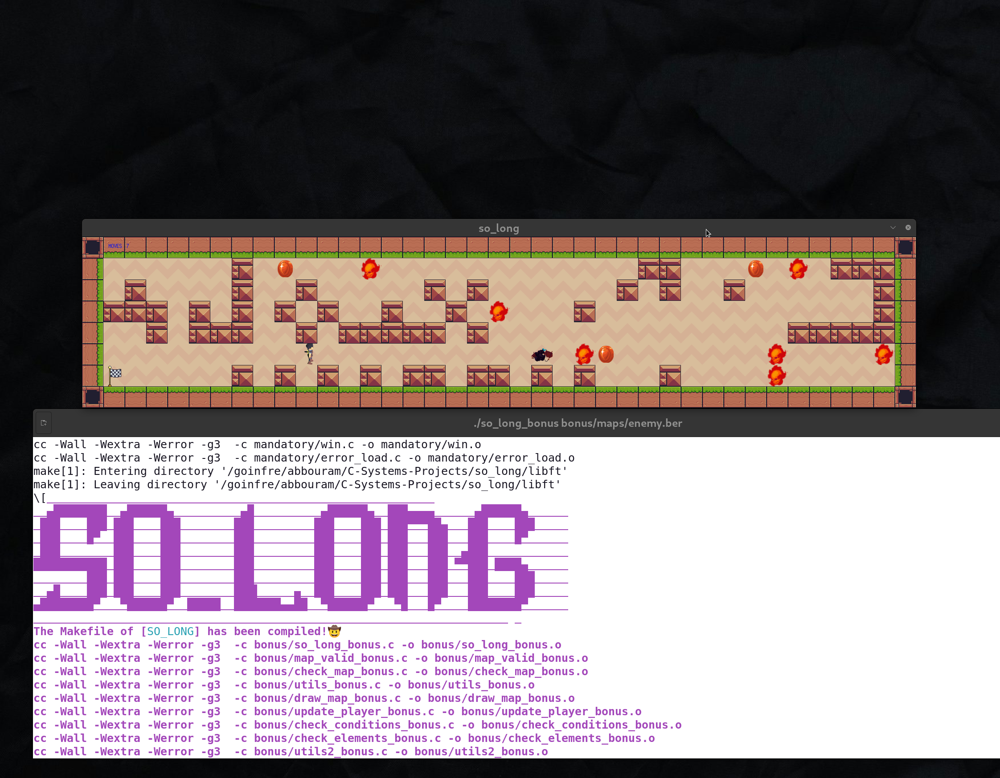

# So_long

A simple 2D game created with the MiniLibX library.



## Description

`so_long` is a small 2D game project from the 42 school curriculum. The goal is to create a simple game where the player has to collect all collectibles on a map and then reach the exit.

## Game Elements

-   **Player (P):** The character controlled by the user.
-   **Wall (1):** An obstacle that the player cannot pass through.
-   **Collectible (C):** An item that the player must collect.
-   **Exit (E):** The exit of the map. It only opens after all collectibles have been gathered.
-   **Empty Space (0):** A walkable tile.

## Rules

- The player must be able to move up, down, left, and right.
- The player must collect all collectibles on the map.
- Once all collectibles are collected, the player can move to the exit to win the game.
- The game window should close when the player clicks the red cross or presses the `ESC` key.
- The number of moves should be displayed in the terminal.

## Map Requirements

The map must:
- Be a rectangular file with the `.ber` extension.
- Be composed of only the five characters: `0`, `1`, `C`, `E`, `P`.
- Be surrounded by walls (`1`).
- Have at least one exit (`E`), one player starting position (`P`), and one collectible (`C`).
- Have a valid path to all collectibles and the exit.

## How to Use

1.  **Clone the repository:**
    ```bash
    git clone <repository_url>
    cd C-Systems-Projects/so_long
    ```

2.  **Compile the project:**
    The project uses the `MiniLibX` graphics library. The `Makefile` will handle the setup.
    ```bash
    make
    ```

3.  **Run the game:**
    Provide a map file as an argument.
    ```bash
    ./so_long maps/map1.ber
    ```

## Controls

-   **W / ↑:** Move up
-   **A / ←:** Move left
-   **S / ↓:** Move down
-   **D / →:** Move right
-   **ESC:** Quit the game

## Bonus Features

The bonus version of `so_long` includes:
-   **Animated Sprites:** The player and collectibles have simple animations.
-   **Enemies:** The map can include enemies that, if touched, will cause the player to lose.
-   **Move Counter on Screen:** The number of moves is displayed in the game window instead of the terminal.

To compile the bonus version, use:
```bash
make bonus
```
Then run `./so_long_bonus maps/map_bonus.ber`.
